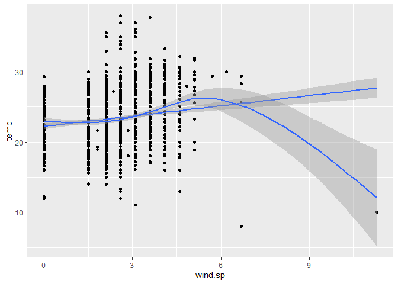
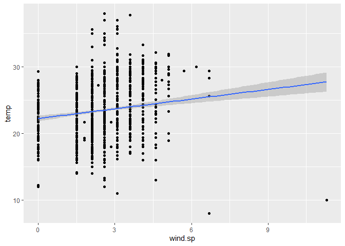
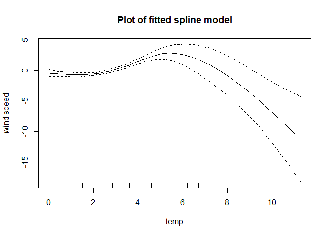

Lab 05 - Data Wrangling
================

# Learning goals

-   Use the `merge()` function to join two datasets.
-   Deal with missings and impute data.
-   Identify relevant observations using `quantile()`.
-   Practice your GitHub skills.

# Lab description

For this lab we will be dealing with the meteorological dataset `met`.
In this case, we will use `data.table` to answer some questions
regarding the `met` dataset, while at the same time practice your
Git+GitHub skills for this project.

This markdown document should be rendered using `github_document`
document.

# Part 1: Setup a Git project and the GitHub repository

1.  Go to wherever you are planning to store the data on your computer,
    and create a folder for this project

2.  In that folder, save [this
    template](https://github.com/JSC370/jsc370-2023/blob/main/labs/lab05/lab05-wrangling-gam.Rmd)
    as “README.Rmd”. This will be the markdown file where all the magic
    will happen.

3.  Go to your GitHub account and create a new repository of the same
    name that your local folder has, e.g., “JSC370-labs”.

4.  Initialize the Git project, add the “README.Rmd” file, and make your
    first commit.

5.  Add the repo you just created on GitHub.com to the list of remotes,
    and push your commit to origin while setting the upstream.

Most of the steps can be done using command line:

``` sh
# Step 1
cd ~/Documents
mkdir JSC370-labs
cd JSC370-labs

# Step 2
wget https://raw.githubusercontent.com/JSC370/jsc370-2023/main/labs/lab05/lab05-wrangling-gam.Rmd
mv lab05-wrangling-gam.Rmd README.Rmd
# if wget is not available,
curl https://raw.githubusercontent.com/JSC370/jsc370-2023/main/labs/lab05/lab05-wrangling-gam.Rmd --output README.Rmd

# Step 3
# Happens on github

# Step 4
git init
git add README.Rmd
git commit -m "First commit"

# Step 5
git remote add origin git@github.com:[username]/JSC370-labs
git push -u origin master
```

You can also complete the steps in R (replace with your paths/username
when needed)

``` r
# Step 1
setwd("~/Documents")
dir.create("JSC370-labs")
setwd("JSC370-labs")

# Step 2
download.file(
  "https://raw.githubusercontent.com/JSC370/jsc370-2023/main/labs/lab05/lab05-wrangling-gam.Rmd",
  destfile = "README.Rmd"
  )

# Step 3: Happens on Github

# Step 4
system("git init && git add README.Rmd")
system('git commit -m "First commit"')

# Step 5
system("git remote add origin git@github.com:[username]/JSC370-labs")
system("git push -u origin master")
```

Once you are done setting up the project, you can now start working with
the MET data.

## Setup in R

1.  Load the `data.table` (and the `dtplyr` and `dplyr` packages if you
    plan to work with those).

``` r
library(data.table)
library(dtplyr)
library(dplyr)
```

2.  Load the met data from
    <https://github.com/JSC370/jsc370-2023/blob/main/labs/lab03/met_all.gz>
    or (Use
    <https://raw.githubusercontent.com/JSC370/jsc370-2023/main/labs/lab03/met_all.gz>
    to download programmatically), and also the station data. For the
    latter, you can use the code we used during lecture to pre-process
    the stations data:

``` r
fn <- "https://raw.githubusercontent.com/JSC370/jsc370-2023/main/labs/lab03/met_all.gz"
if (!file.exists("met_all.gz"))
  download.file(fn, destfile = "met_all.gz")
met <- data.table::fread("met_all.gz")
```

``` r
# Download the data
stations <- fread("ftp://ftp.ncdc.noaa.gov/pub/data/noaa/isd-history.csv")
stations[, USAF := as.integer(USAF)]
```

    ## Warning in eval(jsub, SDenv, parent.frame()): NAs introduced by coercion

``` r
# Dealing with NAs and 999999
stations[, USAF   := fifelse(USAF == 999999, NA_integer_, USAF)]
stations[, CTRY   := fifelse(CTRY == "", NA_character_, CTRY)]
stations[, STATE  := fifelse(STATE == "", NA_character_, STATE)]

# Selecting the three relevant columns, and keeping unique records
stations <- unique(stations[, list(USAF, CTRY, STATE)])

# Dropping NAs
stations <- stations[!is.na(USAF)]

# Removing duplicates
stations[, n := 1:.N, by = .(USAF)]
stations <- stations[n == 1,][, n := NULL]
```

3.  Merge the data as we did during the lecture.

``` r
merged <- merge(x=met,
                y=stations,
                by.x="USAFID",
                by.y="USAF",
                all.x=T,
                all.y=F)

nrow(merged) # should be 2377343
```

    ## [1] 2377343

``` r
# allows us to use data.table with tidyverse functions
# just makes things faster.
lz = lazy_dt(merged, immutable=FALSE)
```

## Question 1: Representative station for the US

Across all weather stations, what is the median station in terms of
temperature, wind speed, and atmospheric pressure? Look for the three
weather stations that best represent continental US using the
`quantile()` function. Do these three coincide?

I averaged variables of interest for each weather station.

``` r
# met_avg <- merged[ , .(
#   temp = mean(temp, na.rm = TRUE),
#   atm.press = mean(atm.press, na.rm=TRUE),
#   wind.sp = mean(wind.sp, na.rm = TRUE)
# ), by = "USAFID"]

# average across stations
met_avg_lz <- lz %>% 
  group_by(USAFID) %>% 
  summarise(
    across(c(temp, wind.sp, atm.press),
           function(x) mean(x, na.rm=TRUE))
  )
```

``` r
met_med_lz <- met_avg_lz %>% 
  summarise(across(
    2:4, # second to fourth column
    function(x) quantile(x, probs=.5, na.rm=T)
  ))
# met_med_lz
```

``` r
met_diffs <- met_avg_lz %>% # we have to use pull instead of $
  mutate(
    temp_diff = abs(temp - met_med_lz %>%  pull(temp)),
    sp_diff = abs(wind.sp - met_med_lz %>% pull(wind.sp)),
    pdiff = abs(atm.press - met_med_lz %>% pull(atm.press))
  )

as.data.frame(met_diffs %>% arrange(temp_diff) %>% slice(1))
```

    ##   USAFID     temp  wind.sp atm.press   temp_diff  sp_diff pdiff
    ## 1 720458 23.68173 1.209682       NaN 0.002328907 1.252156   NaN

``` r
as.data.frame(met_diffs %>% arrange(sp_diff) %>% slice(1))
```

    ##   USAFID     temp  wind.sp atm.press temp_diff sp_diff pdiff
    ## 1 720929 17.43278 2.461838       NaN  6.251284       0   NaN

``` r
as.data.frame(met_diffs %>% arrange(pdiff) %>% slice(1))
```

    ##   USAFID     temp  wind.sp atm.press temp_diff   sp_diff        pdiff
    ## 1 722238 26.13978 1.472656  1014.691  2.455719 0.9891817 0.0005376377

``` r
lz %>% 
  select(c('USAFID', 'lon', 'lat')) %>% 
  distinct() %>%   
  filter(USAFID %in% c(720458, 720929, 722238))
```

    ## Source: local data table [4 x 3]
    ## Call:   unique(`_DT1`[, .(USAFID, lon, lat)])[USAFID %in% c(720458, 720929, 
    ##     722238)]
    ## 
    ##   USAFID   lon   lat
    ##    <int> <dbl> <dbl>
    ## 1 720458 -82.6  37.8
    ## 2 720929 -92.0  45.5
    ## 3 722238 -85.7  31.4
    ## 4 722238 -85.7  31.3
    ## 
    ## # Use as.data.table()/as.data.frame()/as_tibble() to access results

We see the longitudes and latitudes are kind of close. A few degrees of
difference in longitude and latitude makes a large difference in
distance, but their longitudes and latitudes are close. One station is
repeated twice, as its coordinates changed.

The representative stations for the US, in terms of temperature, wind
speed and atmospheric pressure, are all different.

Knit the document, commit your changes, and save it on GitHub. Don’t
forget to add `README.md` to the tree, the first time you render it.

## Question 2: Representative station per state

Just like the previous question, you are asked to identify what is the
most representative, the median, station per state. This time, instead
of looking at one variable at a time, look at the euclidean distance. If
multiple stations show in the median, select the one located at the
lowest latitude.

<!-- basically do the same thing as before, but go by state. Get one station by state. Look at euclidean distance for (temp, windspeed, atmospheric pressure) with the median from the first question. -->

“the most representative”

``` r
# redo lz by state and to include lat and lon
met_avg_lz <- lz %>% 
  group_by(USAFID) %>% 
  summarise(
    across(c(temp, wind.sp, atm.press),
           function(x) coalesce(mean(x, na.rm=TRUE), 0)),
    STATE = first(STATE),
    lat = first(lat),
    lon = first(lon)
  )

# get as data frame
met_med_lz = as.data.frame(met_med_lz)

# calculate the Euclidean distance between each station and the median vector
lz_with_distance <- met_avg_lz %>% 
  mutate(distance = sqrt((temp - met_med_lz$temp)^2 + 
                         (wind.sp - met_med_lz$wind.sp)^2 + 
                         (atm.press - met_med_lz$atm.press)^2)) %>% 
  select(STATE, lat, lon, distance, USAFID)

# for each state, select the station with the minimum distance
# if multiple stations show in the median, select the one located at the lowest latitude
result2 <- lz_with_distance %>% 
  group_by(STATE) %>% 
  slice_min(n = 1, order_by = distance) %>% 
  select(STATE, lat, lon)
```

I coalesced missing atmospheric pressure values to 0. Thus, the table
would prioritize stations with all three recorded values over those
missing atmospheric pressure.

Ties didn’t have to be broken in this case. Only two states had all
stations with missing atmospheric pressure.

Here are the first few “most representative stations,” by state.

``` r
head(as.data.frame(result2))
```

    ##   STATE    lat      lon
    ## 1    AL 34.653  -86.945
    ## 2    AR 36.267  -93.157
    ## 3    AZ 34.518 -109.379
    ## 4    CA 41.781 -122.468
    ## 5    CO 40.436 -104.631
    ## 6    CT 41.264  -72.887

Knit the doc and save it on GitHub.

## Question 3: In the middle?

For each state, identify what is the station that is closest to the
mid-point of the state. Combining these with the stations you identified
in the previous question, use `leaflet()` to visualize all \~100 points
in the same figure, applying different colors for those identified in
this question.

mid point probably calculated as avg point for each state idk.

``` r
# redo lz by state and to include lat and lon
met_avg_lz <- lz %>% 
  group_by(USAFID) %>% 
  summarise(
    across(c(temp, wind.sp, atm.press),
           function(x) mean(x, na.rm=TRUE)),
    STATE = first(STATE),
    lat = first(lat),
    lon = first(lon)
  )

# midpoints by taking median lat lon by state.
mid_points <- met_avg_lz %>% group_by(STATE) %>% 
  summarise(
            medlat = median(lat),
            medlong = median(lon))

# get distances from station to midpoints
lz_with_distance <- met_avg_lz %>% 
  left_join(mid_points, by = "STATE") %>% 
  mutate(distance = sqrt((lat - medlat)^2 + (lon - medlong)^2))

# select station with the minimum distance per state
result3 <- lz_with_distance %>% 
  group_by(STATE) %>% 
  filter(distance == min(distance)) %>% 
  select(STATE, lat, lon)

# result stored in lat and lon
# only 42 points, for 42 states. This is acceptable, may have missing data.
```

Both Q2 and 3 have 42 observations, most likely because only 42 states
were included in the data.

**The leaflet plot below most likely will not show in the markdown
document. Please inspect the html document to see the plot**

``` r
library(leaflet)
```

    ## Warning: package 'leaflet' was built under R version 4.1.3

``` r
# Concatenate the two tables
result2 <- as.data.frame(result2)
result3 <- as.data.frame(result3)
result2$source='result2'
result3$source='result3'
result_combined <- rbind(result2, result3)

pal <- colorFactor(
  palette = c('blue', 'red'),
  domain = c("result2", "result3")
)

# plot 
leaflet(result_combined) %>% addProviderTiles('OpenStreetMap') %>% 
  addCircles(lng= ~lon, lat= ~lat, radius=30000, 
             color=~pal(source), stroke=F, fillOpacity=1) %>% 
  addLegend(colors=c('blue', 'red'), labels=c("Representative(Q2)", "Middle(Q3)"), title = "Season", position = "bottomright")
```

<div class="leaflet html-widget html-fill-item-overflow-hidden html-fill-item" id="htmlwidget-3df042312b9b417dee79" style="width:672px;height:480px;"></div>
<script type="application/json" data-for="htmlwidget-3df042312b9b417dee79">{"x":{"options":{"crs":{"crsClass":"L.CRS.EPSG3857","code":null,"proj4def":null,"projectedBounds":null,"options":{}}},"calls":[{"method":"addProviderTiles","args":["OpenStreetMap",null,null,{"errorTileUrl":"","noWrap":false,"detectRetina":false}]},{"method":"addCircles","args":[[34.653,36.267,34.518,41.781,40.436,41.264,39.674,30.65,34.272,40.783,43.65,38.764,39.825,39.008,37.9,31.395,42.47,38.341,43.65,42.233,44.883,37.75,33.45,45.8,35.742,46.218,41.117,43.083,39.366,36.744,39.417,40.779,39.594,36.768,42.367,40.65,41.35,34.987,43.583,36.624,30.371,40.443,36.573,44.467,46.683,42.95,39.404,44.517,36.319,31.083,43.322,34.283,40.483,38.704,35.6,42.367,47.104,32.633,44.859,32.383,40.648,35.582,37.4,41.691,40.217,40.967,43.5,44.359,39,39.326,33.467,35.417,43.067,30.558,37.578,28.29,39.05,40.28,40.033,35.003,38.058,48.39,44.534,32.317,41.51,39.601,40.219,44.381,36.009,41.702,41.597,41.876,39.133,43.567,44.533,45.8],[-86.945,-93.157,-109.379,-122.468,-104.631,-72.887,-75.606,-86.523,-83.83,-91.125,-116.633,-87.606,-86.296,-95.212,-85.967,-92.291,-71.289,-75.513,-70.317,-83.533,-93.217,-92.15,-88.583,-108.533,-81.382,-100.245,-95.917,-70.817,-75.078,-108.229,-118.716,-73.969,-84.226,-96.026,-122.867,-75.433,-71.799,-81.058,-96.733,-87.419,-104.018,-109.512,-79.335,-73.15,-122.983,-87.9,-77.945,-108.082,-119.628,-97.683,-84.688,-80.567,-88.95,-93.183,-92.45,-122.867,-122.287,-83.6,-94.382,-86.35,-86.152,-79.101,-77.517,-93.566,-76.851,-98.317,-114.3,-89.837,-80.274,-76.414,-111.733,-97.383,-108.45,-92.099,-84.77,-81.437,-105.516,-83.115,-74.35,-105.662,-97.275,-100.024,-72.614,-90.083,-72.828,-116.005,-111.723,-100.285,-86.52,-74.795,-71.412,-71.021,-75.467,-71.433,-69.667,-108.533],30000,null,null,{"interactive":true,"className":"","stroke":false,"color":["#0000FF","#0000FF","#0000FF","#0000FF","#0000FF","#0000FF","#0000FF","#0000FF","#0000FF","#0000FF","#0000FF","#0000FF","#0000FF","#0000FF","#0000FF","#0000FF","#0000FF","#0000FF","#0000FF","#0000FF","#0000FF","#0000FF","#0000FF","#0000FF","#0000FF","#0000FF","#0000FF","#0000FF","#0000FF","#0000FF","#0000FF","#0000FF","#0000FF","#0000FF","#0000FF","#0000FF","#0000FF","#0000FF","#0000FF","#0000FF","#0000FF","#0000FF","#0000FF","#0000FF","#0000FF","#0000FF","#0000FF","#0000FF","#FF0000","#FF0000","#FF0000","#FF0000","#FF0000","#FF0000","#FF0000","#FF0000","#FF0000","#FF0000","#FF0000","#FF0000","#FF0000","#FF0000","#FF0000","#FF0000","#FF0000","#FF0000","#FF0000","#FF0000","#FF0000","#FF0000","#FF0000","#FF0000","#FF0000","#FF0000","#FF0000","#FF0000","#FF0000","#FF0000","#FF0000","#FF0000","#FF0000","#FF0000","#FF0000","#FF0000","#FF0000","#FF0000","#FF0000","#FF0000","#FF0000","#FF0000","#FF0000","#FF0000","#FF0000","#FF0000","#FF0000","#FF0000"],"weight":5,"opacity":0.5,"fill":true,"fillColor":["#0000FF","#0000FF","#0000FF","#0000FF","#0000FF","#0000FF","#0000FF","#0000FF","#0000FF","#0000FF","#0000FF","#0000FF","#0000FF","#0000FF","#0000FF","#0000FF","#0000FF","#0000FF","#0000FF","#0000FF","#0000FF","#0000FF","#0000FF","#0000FF","#0000FF","#0000FF","#0000FF","#0000FF","#0000FF","#0000FF","#0000FF","#0000FF","#0000FF","#0000FF","#0000FF","#0000FF","#0000FF","#0000FF","#0000FF","#0000FF","#0000FF","#0000FF","#0000FF","#0000FF","#0000FF","#0000FF","#0000FF","#0000FF","#FF0000","#FF0000","#FF0000","#FF0000","#FF0000","#FF0000","#FF0000","#FF0000","#FF0000","#FF0000","#FF0000","#FF0000","#FF0000","#FF0000","#FF0000","#FF0000","#FF0000","#FF0000","#FF0000","#FF0000","#FF0000","#FF0000","#FF0000","#FF0000","#FF0000","#FF0000","#FF0000","#FF0000","#FF0000","#FF0000","#FF0000","#FF0000","#FF0000","#FF0000","#FF0000","#FF0000","#FF0000","#FF0000","#FF0000","#FF0000","#FF0000","#FF0000","#FF0000","#FF0000","#FF0000","#FF0000","#FF0000","#FF0000"],"fillOpacity":1},null,null,null,{"interactive":false,"permanent":false,"direction":"auto","opacity":1,"offset":[0,0],"textsize":"10px","textOnly":false,"className":"","sticky":true},null,null]},{"method":"addLegend","args":[{"colors":["blue","red"],"labels":["Representative(Q2)","Middle(Q3)"],"na_color":null,"na_label":"NA","opacity":0.5,"position":"bottomright","type":"unknown","title":"Season","extra":null,"layerId":null,"className":"info legend","group":null}]}],"limits":{"lat":[28.29,48.39],"lng":[-122.983,-69.667]}},"evals":[],"jsHooks":[]}</script>

Knit the doc and save it on GitHub.

## Question 4: Means of means

Using the `quantile()` function, generate a summary table that shows the
number of states included, average temperature, wind-speed, and
atmospheric pressure by the variable “average temperature level,” which
you’ll need to create.

Start by computing the states’ average temperature. Use that measurement
to classify them according to the following criteria:

-   low: temp &lt; 20
-   Mid: temp &gt;= 20 and temp &lt; 25
-   High: temp &gt;= 25

``` r
# create new variable
met_avg_lz <- met_avg_lz %>% 
  mutate(temp_level = case_when(
    temp < 20 ~ "Low",
    temp >= 20 & temp < 25 ~ "Mid",
    temp >= 25 ~ "High"
  ))

met_sum5 <- met_avg_lz %>% 
  group_by(temp_level) %>% 
  summarize(n = n(),
            median_temp = quantile(temp, 0.5, na.rm=T),
            median_wind_sp = quantile(wind.sp, 0.5, na.rm=T),
            median_atm_press = quantile(atm.press, 0.5, na.rm=T))

as.data.frame(met_sum5)
```

    ##   temp_level   n median_temp median_wind_sp median_atm_press
    ## 1       <NA>   7          NA       2.454595               NA
    ## 2       High 618    27.46616       2.553837         1014.215
    ## 3        Low 275    18.75935       2.386705         1014.846
    ## 4        Mid 695    22.37195       2.449935         1014.790

I assumed that since you wanted to use the quantile() function, we
should calculate the median temp, wind speed and atmospheric pressure.

There are a few observations of stations with no recorded temperatures.
Among the rest of the stations, a large proportion of them are in the
middle or high temperature level. The median wind speed and atmospheric
pressure across the groups seem similar.

------------------------------------------------------------------------

Once you are done with that, you can compute the following:

-   Number of entries (records),
-   Number of NA entries,
-   Number of stations,
-   Number of states included, and
-   Mean temperature, wind-speed, and atmospheric pressure.

All by the levels described before.

``` r
met_sum6 <- met_avg_lz %>% 
  group_by(temp_level) %>% 
  summarize(n = n(),
            median_temp = quantile(temp, 0.5, na.rm=T),
            median_wind_sp = quantile(wind.sp, 0.5, na.rm=T),
            median_atm_press = quantile(atm.press, 0.5, na.rm=T))

met_sum6 <- met_avg_lz %>% 
  group_by(temp_level) %>% 
  summarize(n_entries = n(),
            n_NA = sum(is.na(temp) | is.na(wind.sp) | is.na(atm.press)),
            n_stations = n_distinct(USAFID),
            n_states = n_distinct(STATE),
            mean_temp = mean(temp, na.rm = TRUE),
            mean_wind_sp = mean(wind.sp, na.rm = TRUE),
            mean_atm_press = mean(atm.press, na.rm = TRUE))

as.data.frame(met_sum6)
```

    ##   temp_level n_entries n_NA n_stations n_states mean_temp mean_wind_sp
    ## 1       <NA>         7    7          7        6       NaN     2.454595
    ## 2       High       618  271        618       25  27.92512     2.692951
    ## 3        Low       275  143        275       26  18.18823     2.554944
    ## 4        Mid       695  275        695       43  22.46706     2.486676
    ##   mean_atm_press
    ## 1            NaN
    ## 2       1013.433
    ## 3       1014.954
    ## 4       1014.519

Since each row in the earlier table represented a singular station, the
number of stations in each category simply equals the number of entries.
We see there are a large number of rows with at least 1 NA value. We
also see that the ‘mid’ range for average temperature has weather
stations from the most states, compared to the other two ranges.

Knit the document, commit your changes, and push them to GitHub.

## Question 5: Advanced Regression

Let’s practice running regression models with smooth functions on X. We
need the `mgcv` package and `gam()` function to do this.

-   using your data with the median values per station, examine the
    association between median temperature (y) and median wind speed
    (x). Create a scatterplot of the two variables using ggplot2. Add
    both a linear regression line and a smooth line.

-   fit both a linear model and a spline model (use `gam()` with a cubic
    regression spline on wind speed). Summarize and plot the results
    from the models and interpret which model is the best fit and why.

``` r
library(ggplot2)
```

    ## Warning: package 'ggplot2' was built under R version 4.1.3

``` r
# previous dataframe calculates mean values
# we have to recalculate median values
met_md_lz <- lz %>% 
  group_by(USAFID) %>% 
  summarise(
    across(c(temp, wind.sp, atm.press),
           function(x) median(x, na.rm=TRUE)),
    STATE = first(STATE),
    lat = first(lat),
    lon = first(lon)
  )

ggplot(as.data.frame(met_md_lz), aes(x=wind.sp, y=temp)) +
  geom_point() +
  geom_smooth(formula=y~x, method='lm') +
  geom_smooth()
```

    ## Warning: Removed 16 rows containing non-finite values (`stat_smooth()`).

    ## `geom_smooth()` using method = 'gam' and formula = 'y ~ s(x, bs = "cs")'

    ## Warning: Removed 16 rows containing non-finite values (`stat_smooth()`).

    ## Warning: Removed 16 rows containing missing values (`geom_point()`).

<!-- --> We see that
the linear regression seems to capture some patterns in the data, but
the LOESS curve suggests some curvature to the pattern. The LOESS curve
is too sensitive to outliers in wind speed.

### Linear model

``` r
ggplot(as.data.frame(met_md_lz), aes(x=wind.sp, y=temp)) +
  geom_point() +
  geom_smooth(formula=y~x, method='lm')
```

    ## Warning: Removed 16 rows containing non-finite values (`stat_smooth()`).

    ## Warning: Removed 16 rows containing missing values (`geom_point()`).

<!-- -->

``` r
tmptbl <- as.data.frame(met_md_lz)

linmod <- lm(tmptbl$temp~tmptbl$wind.sp)
summary(linmod)
```

    ## 
    ## Call:
    ## lm(formula = tmptbl$temp ~ tmptbl$wind.sp)
    ## 
    ## Residuals:
    ##      Min       1Q   Median       3Q      Max 
    ## -17.7243  -2.6518  -0.2309   2.7691  14.5052 
    ## 
    ## Coefficients:
    ##                Estimate Std. Error t value Pr(>|t|)    
    ## (Intercept)    22.23088    0.21779  102.08  < 2e-16 ***
    ## tmptbl$wind.sp  0.48614    0.08212    5.92 3.94e-09 ***
    ## ---
    ## Signif. codes:  0 '***' 0.001 '**' 0.01 '*' 0.05 '.' 0.1 ' ' 1
    ## 
    ## Residual standard error: 3.849 on 1577 degrees of freedom
    ##   (16 observations deleted due to missingness)
    ## Multiple R-squared:  0.02174,    Adjusted R-squared:  0.02112 
    ## F-statistic: 35.05 on 1 and 1577 DF,  p-value: 3.941e-09

Visually, the linear regression fits the data decently. We see that the
individual t-tests for the estimated coefficients, and the ANOVA test
suggest that y is linearly related to x. However, the r-squared value is
very low, suggesting the model doesn’t explain much of the variance in
y.

``` r
library(mgcv)
# gonna assume cs is cubic splines
gamd <- gam(temp ~ s(wind.sp, bs = "cs"), data=tmptbl)
summary(gamd)
```

    ## 
    ## Family: gaussian 
    ## Link function: identity 
    ## 
    ## Formula:
    ## temp ~ s(wind.sp, bs = "cs")
    ## 
    ## Parametric coefficients:
    ##             Estimate Std. Error t value Pr(>|t|)    
    ## (Intercept) 23.38566    0.09549   244.9   <2e-16 ***
    ## ---
    ## Signif. codes:  0 '***' 0.001 '**' 0.01 '*' 0.05 '.' 0.1 ' ' 1
    ## 
    ## Approximate significance of smooth terms:
    ##              edf Ref.df     F p-value    
    ## s(wind.sp) 4.808      9 8.961  <2e-16 ***
    ## ---
    ## Signif. codes:  0 '***' 0.001 '**' 0.01 '*' 0.05 '.' 0.1 ' ' 1
    ## 
    ## R-sq.(adj) =  0.0486   Deviance explained = 5.15%
    ## GCV = 14.451  Scale est. = 14.398    n = 1579

We see that the adjusted r squared is almost twice as high as the linear
model.

``` r
plot(gamd, xlab="temp", ylab="wind speed", main="Plot of fitted spline model")
```

<!-- --> The spline
model finds a similar curve to the LOESS curve shown before. It is
heavily impacted by the outlier with high wind speed and low
temperature.
